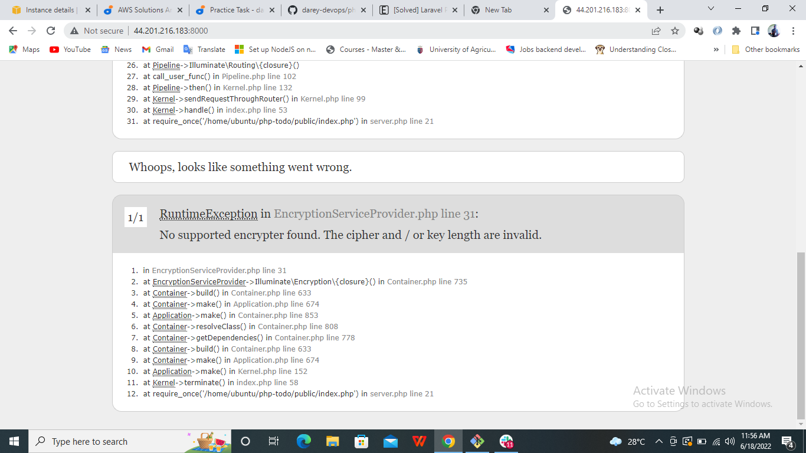

#  My first Story

### creating a paragraph in markdow
This is a project where I practiced my git skills.

It was exciting!!!!!

### creating a list in markdown
- Ronaldo
- Eto
- Oshimen

1. Chelsea
1. Manchester United
1. Liverpool

### create a link to document in markdown

[google](https://google.com)

### create bold and italicize text in markdown

**BOLD**

*italice*

### adding images to document using markdown



### adding code snippet and commands using markdown

`sudo apt install nginx -y `

```
x = 5
print(x)

```
